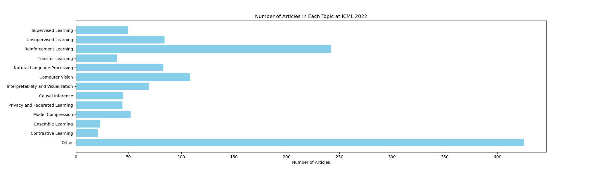
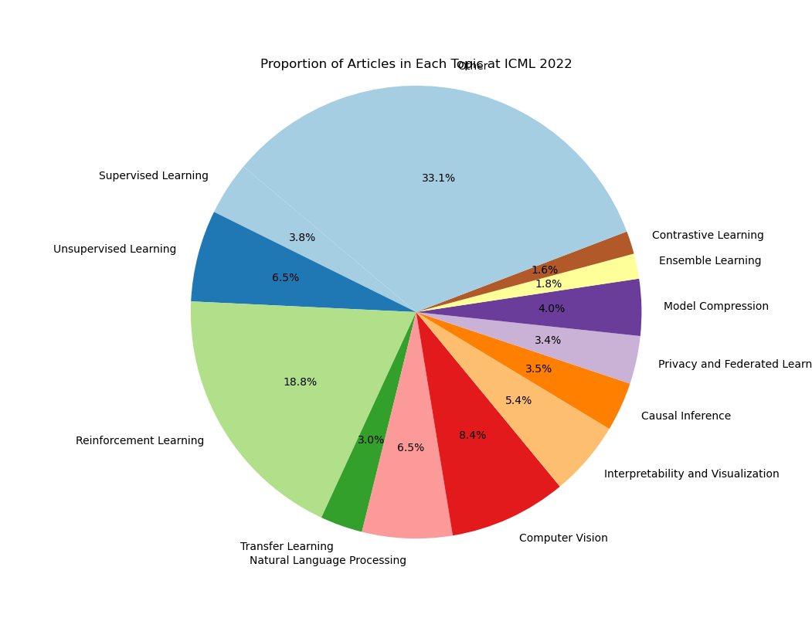

# Summary-of-ICML-2022

对2022的ICML会议进行分类汇总，方便大家查找自己感兴趣的文章。有问题请提issue

> **大部分文章只扫了题目和部分摘要就进行了分类，所以并不保证准确性**

2022 ICML会议，共收录了`1248`篇文章

1. [监督学习(supervised learning)](1.监督学习.md): `49` 篇
2. [无监督学习(unsupervised learning)](2.无监督学习.md): `84` 篇
3. [强化学习(reinforcement learning)](3.强化学习.md): `242` 篇
4. [迁移学习与领域自适应(transfer learning and domain adaptation)](4.迁移学习与领域自适应.md): `39` 篇
5. [自然语言处理(natural language processing)](5.自然语言处理.md): `83` 篇
6. [计算机视觉(computer vision)](6.计算机视觉.md): `108` 篇
7. [可解释性与可视化(interpretability and visualization)](7.可解释性与可视化.md): `69` 篇
8. [因果推断(causal inference)](8.因果推断.md): `45` 篇
9. [隐私保护与联邦学习(privacy and federated learning)](9.隐私保护与联邦学习.md): `44` 篇
10. [模型压缩(model compression)](10.模型压缩.md): `52` 篇
11. [集成学习(ensemble learning)](11.集成学习.md): `23` 篇
12. [对比学习(contrastive learning)](12.对比学习.md): `21` 篇
13. [其他(other)](13.其他.md): `425` 篇
14. [summary](summary.md)

- [title 汇总](title汇总.md): `1248` 篇

------------------------------------------------------------------

